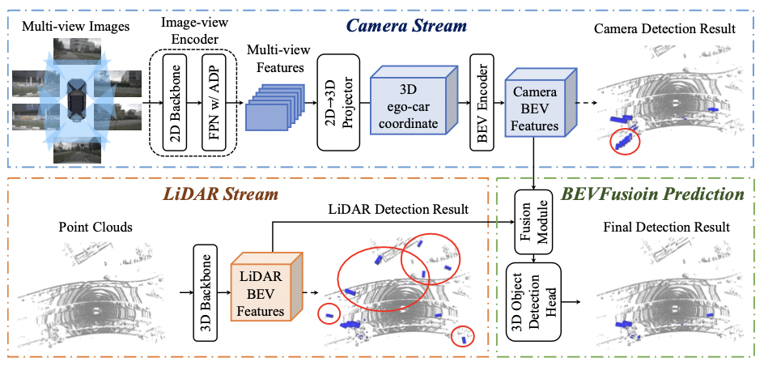
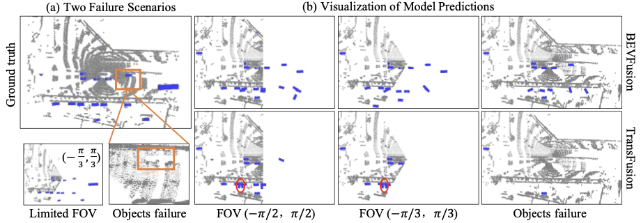

# BEVFusion: A Simple and Robust LiDAR-Camera Fusion Framework.

This [paper](https://arxiv.org/abs/2205.13790) focuses on LiDAR-camera fusion for 3D object detection. If you find this project useful, please cite:

```bash
@inproceedings{liang2022bevfusion,
  title={{BEVFusion: A Simple and Robust LiDAR-Camera Fusion Framework}},
  author={Tingting Liang, Hongwei Xie, Kaicheng Yu, Zhongyu Xia, Zhiwei Lin, Yongtao Wang, Tao Tang, Bing Wang and Zhi Tang},
  booktitle = {Neural Information Processing Systems (NeurIPS)},
  year={2022}
}
```

## Introduction

Fusing the camera and LiDAR information has become a de-facto standard for 3D object detection tasks. Current methods rely on point clouds from the LiDAR sensor as queries to leverage the feature from the image space. However, people discover that this underlying assumption makes the current fusion framework infeasible to produce any prediction when there is a LiDAR malfunction, regardless of minor or major. This fundamentally limits the deployment capability to realistic autonomous driving scenarios. In contrast, we propose a surprisingly simple yet novel fusion framework, dubbed BEVFusion, whose camera stream does not depend on the input of LiDAR data, thus addressing the downside of previous methods. We empirically show that our framework surpasses the state-of-the-art methods under the normal training settings. Under the robustness training settings that simulate various LiDAR malfunctions, our framework significantly surpasses the state-of-the-art methods by 15.7% to 28.9% mAP. To the best of our knowledge, we are the first to handle realistic LiDAR malfunction and can be deployed to realistic scenarios without any post-processing procedure. 




## Main Results


### nuScenes detection test 

| Model   | Head |3DBackbone |2DBackbone | mAP | NDS  | Link  |
|---------|------|-----------|-----------|-----|------|-------|
| [BEVFusion](configs/bevfusion/bevf_tf_4x8_6e_nusc.py) | TransFusion-L | VoxelNet |Dual-Swin-T |69.2 | 71.8 | [Detection](https://drive.google.com/file/d/1vnGBTl2zCL2JM6EKpDxsqbs_CKayc1Gf/view?usp=sharing)|
| [BEVFusion*](configs/bevfusion/bevf_tf_4x8_10e_nusc_aug.py) | TransFusion-L | VoxelNet |Dual-Swin-T |71.3 | 73.3 | [Leadboard](https://www.nuscenes.org/object-detection?externalData=all&mapData=all&modalities=Any) |


### nuScenes detection validation 

| Model   | Head |3DBackbone |2DBackbone | mAP | NDS  | Model  |
|---------|------|-----------|-----------|-----|------|--------|
| [BEVFusion](configs/bevfusion/cam_stream/bevf_pp_4x8_2x_nusc_cam.py) | PointPillars | - |Dual-Swin-T | 22.9 | 31.1 | [Model](https://drive.google.com/file/d/1OeDjGoKpU1FQ42_18pJZ-UqwxLDc6HRc/view?usp=sharing)|
| [BEVFusion](configs/bevfusion/lidar_stream/hv_pointpillars_secfpn_sbn-all_4x8_2x_nus-3d.py) | PointPillars | PointPillars |- | 35.1 | 49.8 | [Model](https://drive.google.com/file/d/1CBF0g1i23hfS-KRihX9J6QF2CglbWjsM/view?usp=sharing)|
| [BEVFusion](configs/bevfusion/bevf_pp_2x8_1x_nusc.py) | PointPillars | PointPillars |Dual-Swin-T | 53.5 | 60.4 | [Model](https://drive.google.com/file/d/1ibsCQ7cPGDBmhlfwKICnu5ePNL1_KlWg/view?usp=sharing)|
| [BEVFusion](configs/bevfusion/cam_stream/bevf_cp_4x8_20e_nusc_cam.py) | CenterPoint | - | Dual-Swin-T | 27.1 | 32.1 | -|
| [BEVFusion](configs/bevfusion/lidar_stream/centerpoint_0075voxel_second_secfpn_dcn_circlenms_4x8_cyclic_20e_nus.py) | CenterPoint | VoxelNet |-| 57.1 | 65.4 | -|
| [BEVFusion](configs/bevfusion/bevf_cp_4x8_6e_nusc.py) | CenterPoint | VoxelNet | Dual-Swin-T | 64.2 | 68.0 | -|
| [BEVFusion](configs/bevfusion/cam_stream/bevf_tf_4x8_20e_nusc_cam.py) | TransFusion-L | - | Dual-Swin-T | 22.7 | 26.1 | -|
| [BEVFusion](configs/bevfusion/lidar_stream/transfusion_nusc_voxel_L.py) | TransFusion-L | VoxelNet | - | 64.9 | 69.9 | -|
| [BEVFusion](configs/bevfusion/bevf_tf_4x8_6e_nusc.py) | TransFusion-L | VoxelNet | Dual-Swin-T | 67.9 | 71.0 | -|
| [BEVFusion*](configs/bevfusion/bevf_tf_4x8_10e_nusc_aug.py) | TransFusion-L | VoxelNet | Dual-Swin-T | 69.6 | 72.1 | [Model](https://drive.google.com/file/d/1tAJA3_5jkE3IAuS_7l8fRNKYSfSEgU5u/view?usp=sharing) |

*: These methods exploit BEV-space data augmentation during training.

##### Acknowledgements of BEV-space augmentation

We conduct the BEV-space augmentation (GlobalRotScaleTransBEV and RandomFlip3DBEV) implemented by [BEVFusion-mit](https://github.com/mit-han-lab/bevfusion). You can also refer [BEVDet](https://github.com/HuangJunJie2017/BEVDet), [DEVDepth](https://github.com/Megvii-BaseDetection/BEVDepth) for more implementation versions.

Moreover, there are also image-sapce augmentations you can explore in [LSS](https://github.com/nv-tlabs/lift-splat-shoot), [BEVDet](https://github.com/HuangJunJie2017/BEVDet),  [BEVFusion-mit](https://github.com/mit-han-lab/bevfusion),  [DEVDepth](https://github.com/Megvii-BaseDetection/BEVDepth).

Thanks for these attractive works and their great open-sourced code bases.


### nuScenes detection validation against LiDAR Malfunctions



Infos for random box dropping in validation set are in [drop_foreground.json](drop_foreground.json), with LiDAR file name: dropping box (True) or not (False).

| Model   | Limited FOV | Objects failure | Head |3DBackbone |2DBackbone | mAP | NDS  | Model  |
|---------|-------------|------------------|------|-----------|-----------|-----|------|--------|
| [BEVFusion](configs/bevfusion/drop_fov/fov60_bevf_pp_2x8_1x_nusc.py) | (-π/3,π/3)|False| PointPillars | PointPillars |Dual-Swin-T | 33.5 | 42.1 | [Model](https://drive.google.com/file/d/18PQ7IEtdNji5nJZCb9d1FVPDfEWA9PU5/view?usp=sharing)|
| [BEVFusion](configs/bevfusion/drop_fov/fov90_bevf_pp_2x8_1x_nusc.py) | (-π/2,π/2)|False| PointPillars | PointPillars |Dual-Swin-T | 36.8 | 45.8 | [Model](https://drive.google.com/file/d/1HLkDsZr3R1FgRX6SeW3XhGKFcUVJluoV/view?usp=sharing)|
| [BEVFusion](configs/bevfusion/drop_bbox/halfbox_bevf_pp_2x8_1x_nusc.py) | -|True| PointPillars | PointPillars |Dual-Swin-T | 41.6 | 51.9 | [Model](https://drive.google.com/file/d/12QESExZCCHC0ZJlHnAi50VAWMU_OA2uo/view?usp=sharing)|
| [BEVFusion](configs/bevfusion/drop_fov/fov60_bevf_cp_2x8_1x_nusc.py) | (-π/3,π/3)|False| CenterPoint | VoxelNet |Dual-Swin-T | 40.9 | 49.9| -|
| [BEVFusion](configs/bevfusion/drop_fov/fov90_bevf_cp_2x8_1x_nusc.py) | (-π/2,π/2)|False| CenterPoint | VoxelNet |Dual-Swin-T | 45.5 | 54.9| -|
| [BEVFusion](configs/bevfusion/drop_bbox/halfbox_bevf_cp_2x8_1x_nusc.py) | -|True| CenterPoint | VoxelNet |Dual-Swin-T | 54.0 | 61.6 | -|
| [BEVFusion](configs/bevfusion/drop_fov/fov60_bevf_tf_2x8_1x_nusc.py) | (-π/3,π/3)|False| TransFusion-L | VoxelNet |Dual-Swin-T | 41.5 | 50.8| -|
| [BEVFusion](configs/bevfusion/drop_fov/fov90_bevf_tf_2x8_1x_nusc.py) | (-π/2,π/2)|False| TransFusion-L | VoxelNet |Dual-Swin-T | 46.4 | 55.8| -|
| [BEVFusion](configs/bevfusion/drop_bbox/halfbox_bevf_tf_2x8_1x_nusc.py) | -|True| TransFusion-L | VoxelNet |Dual-Swin-T | 50.3 | 57.6 | - |

### nuImage detection validation 

| Model   |2DBackbone | bbox_mAP | segm_mAP  | Model  |
|---------|-----------|----------|-----------|--------|
| [Mask R-CNN](configs/bevfusion/cam_stream/mask_rcnn_dbswin-t_fpn_3x_nuim_cocopre.py) |Dual-Swin-T | 56.0 | 46.1 | [Model](https://drive.google.com/file/d/1BcHPxVv_C1LC8oRc-vBhbMk2R6zDYfFx/view?usp=sharing)


## Use BEVFusion

**Installation**

Please refer to [getting_started.md](docs/getting_started.md) for installation of mmdet3d.

Recommended environments:

```shell
python==3.8.3
mmdet==2.11.0 (please install mmdet in mmdetection-2.11.0)
mmcv==1.4.0
mmdet3d==0.11.0
numpy==1.19.2
torch==1.7.0
torchvision==0.8.0
```

**Benchmark Evaluation and Training**

Please refer to [data_preparation.md](docs/getting_started.md) to prepare the data. Then follow the instruction there to train our model. All detection configurations are included in [configs](configs/).

```shell
# training example for bevfusion-pointpillar 
# train nuimage for camera stream backbone and neck.
./tools/dist_train.sh configs/bevfusion/cam_stream/mask_rcnn_dbswin-t_fpn_3x_nuim_cocopre.py 8
# first train camera stream
./tools/dist_train.sh configs/bevfusion/cam_stream/bevf_pp_4x8_2x_nusc_cam.py 8
# then train LiDAR stream
./tools/dist_train.sh configs/bevfusion/lidar_stream/hv_pointpillars_secfpn_sbn-all_4x8_2x_nus-3d.py 8
# then train BEVFusion
./tools/dist_train.sh configs/bevfusion/bevf_pp_2x8_1x_nusc.py 8

### evaluation example for bevfusion-pointpillar
./tools/dist_test.sh configs/bevfusion/bevf_pp_2x8_1x_nusc.py ./work_dirs/bevfusion_pp.pth 8 --eval bbox

### training example for sota Results with BEV_augs
git checkout dev_aug
# first train camera stream
./tools/dist_train.sh configs/bevfusion/cam_stream/bevf_tf_4x8_20e_nusc_cam_lr.py 8
# then train LiDAR stream
./tools/dist_train.sh configs/bevfusion/lidar_stream/transfusion_nusc_voxel_L.py 8
# then train BEVFusion
./tools/dist_train.sh configs/bevfusion/bevf_tf_4x8_10e_nusc_aug.py 8


```

## Acknowlegement

We sincerely thank the authors of [mmdetection3d](https://github.com/open-mmlab/mmdetection3d), [TransFusion](https://github.com/XuyangBai/TransFusion), [LSS](https://github.com/nv-tlabs/lift-splat-shoot), [CenterPoint](https://github.com/tianweiy/CenterPoint) for open sourcing their methods.
